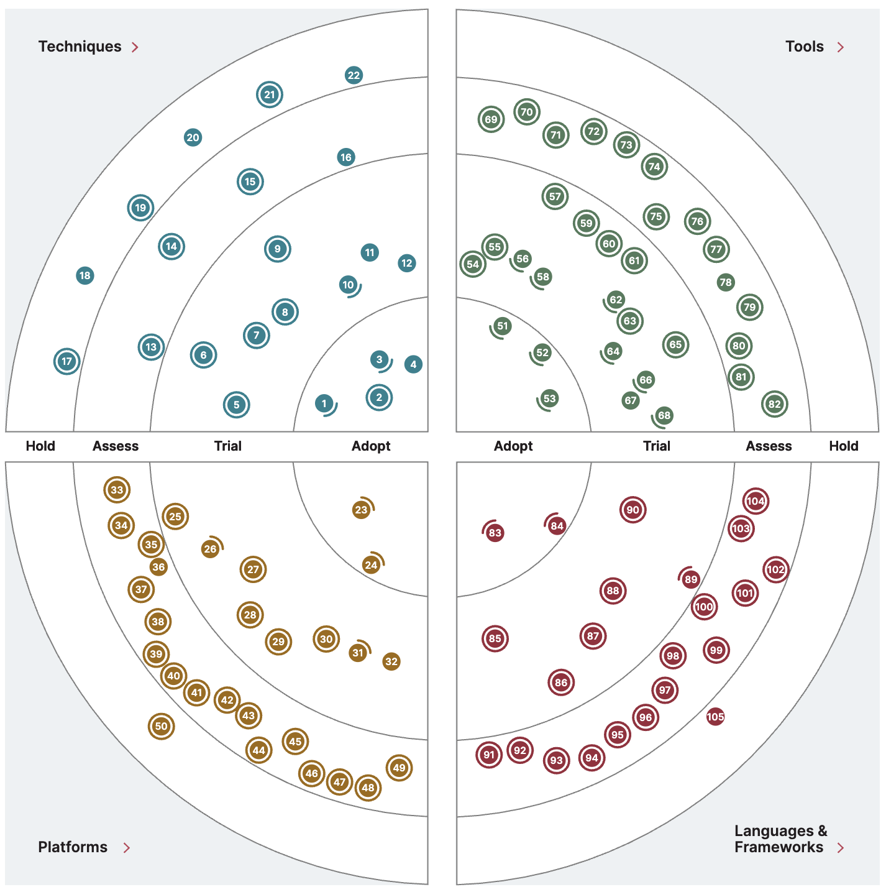

# AI Radar

AI Radar is an artificial intelligence technology radar. This page describes what that means, and how software engineering teams and digital organizations can use AI Radar to help explore new offerings and concepts, and to help prioritize them.

## What is a technology radar?

A technology radar is a visual tool used by organizations to assess and communicate the status of various technologies, tools, frameworks, and practices. It helps teams make informed decisions about which technologies to adopt, trial, or avoid.

The concept is popularized by ThoughtWorks, a software consultancy, which
publishes a widely-followed Technology Radar twice a year.

**Key features:**

The radar typically consists of concentric rings representing different adoption stages:
- **Adopt** - Technologies proven and ready for use
- **Trial** - Worth pursuing in projects that can handle the risk
- **Assess** - Worth exploring to understand their potential
- **Hold** - Proceed with caution or avoid

Technologies are also grouped into quadrants like:
- Techniques (methods, patterns, practices)
- Tools (software tools, frameworks)
- Platforms (infrastructure, operating systems)
- Languages & Frameworks

**Purpose:**

Organizations use technology radars to align their teams on technology strategy, share knowledge about emerging technologies, and manage technical debt by identifying outdated technologies that should be phased out. It's particularly useful for engineering leadership to communicate technology direction and for teams to understand what's recommended versus what should be avoided.

Many companies create their own internal technology radars tailored to their specific context and needs.

## Thoughworks Technology Radar - excerpts

<https://www.thoughtworks.com/en-gb/radar>

### Prompt-to-code

More and more AI tools allow developers to drive implementation directly from an
AI chat within their IDE — a mode also called “agentic”, “prompt-to-code” or
“chat-oriented programming (CHOP).” In this approach, AI assistants go beyond
answering questions or generating small snippets; they navigate and modify code,
update tests, execute commands and, in some cases, proactively fix linting and
compilation errors. - Thoughtworks

### Observability

The increasing adoption of OpenTelemetry is fostering a more standardized
observability landscape, enabling teams to remain vendor-agnostic and more
flexible in their tooling choices. Many leading observability tools — such as
Alloy, Tempo and Loki — now support OpenTelemetry. - Thoughtworks

