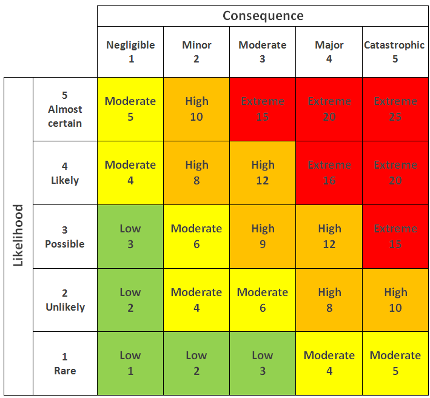

# AI Radar

AI Radar is an artificial intelligence technology radar. This page describes what that means, and how software engineering teams and digital organizations can use AI Radar to help explore new offerings and concepts, and to help prioritize them.

## What is a technology radar?

A technology radar is a visual tool used by organizations to assess and communicate the status of various technologies, tools, frameworks, and practices. It helps teams make informed decisions about which technologies to adopt, trial, or avoid.

The concept is popularized by ThoughtWorks, a software consultancy, which
publishes a widely-followed Technology Radar twice a year.

**Key features:**

The radar typically consists of concentric rings representing different adoption stages:
- **Adopt** - Technologies proven and ready for use
- **Trial** - Worth pursuing in projects that can handle the risk
- **Assess** - Worth exploring to understand their potential
- **Hold** - Proceed with caution or avoid

Technologies are also grouped into quadrants like:
- Techniques (methods, patterns, practices)
- Tools (software tools, frameworks)
- Platforms (infrastructure, operating systems)
- Languages & Frameworks

**Purpose:**

Organizations use technology radars to align their teams on technology strategy, share knowledge about emerging technologies, and manage technical debt by identifying outdated technologies that should be phased out. It's particularly useful for engineering leadership to communicate technology direction and for teams to understand what's recommended versus what should be avoided.

Many companies create their own internal technology radars tailored to their specific context and needs.

## Thoughworks Technology Radar - excerpts

This is the current Thoughtworks Technology Radar:

<https://www.thoughtworks.com/en-gb/radar>

Excerpts below.

### Prompt engineering

Prompt engineering refers to the process of designing and refining prompts for generative AI models to produce high-quality, context-aware responses. This involves crafting clear, specific and relevant prompts tailored to the task or application to optimize the model’s output. As LLM capabilities evolve, particularly with the emergence of reasoning models, prompt engineering practices must also adapt. Based on our experience with AI code generation, we’ve observed that few-shot prompting may underperform compared to simple zero-shot prompting when working with reasoning models. Additionally, the widely used chain-of-thought (CoT) prompting can degrade reasoning model performance — likely because reinforcement learning has already fine-tuned their built-in CoT mechanism.

### Using GenAI to understand legacy codebases

In the past few months, using GenAI to understand legacy codebases has made some real progress. Mainstream tools such as GitHub Copilot are being touted as being able to help modernize legacy codebases. Tools such as Sourcegraph's Cody are making it easier for developers to navigate and understand entire codebases. These tools use a multitude of GenAI techniques to provide contextual help, simplifying work with complex legacy systems. On top of that, specialized frameworks like S3LLM are showing how LLMs can handle large-scale scientific software — such as that written in Fortran or Pascal — bringing GenAI-enhanced understanding to codebases outside of traditional enterprise IT. We think this technique is going to continue to gain traction given the sheer amount of legacy software in the world.

### AI-friendly code design

Supervised software engineering agents are increasingly capable of identifying necessary updates and making larger changes to a codebase. At the same time, we're seeing growing complacency with AI-generated code, and developers becoming reluctant to review large AI-made change sets. A common justification for this is that human-oriented code quality matters less since AI can handle future modifications; however, AI coding assistants also perform better with well-factored codebases, making AI-friendly code design crucial for maintainability.

### AI-powered UI testing

New techniques for AI-powered assistance on software teams are emerging beyond just code generation. One area gaining traction is AI-powered UI testing, leveraging LLMs' abilities to interpret graphical user interfaces. There are several approaches to this. One category of tools uses multi-modal LLMs fine-tuned for UI snapshot processing, allowing test scripts written in natural language to navigate an application. Examples in this space include QA.tech or LambdaTests' KaneAI. Another approach, seen in Browser Use, combines multi-modal foundation models with Playwright's insights into a web page's structure rather than relying on fine-tuned models.

### Unblocked

Unblocked is an off-the-shelf AI team assistant. Once integrated with codebase repositories, corporate documentation platforms, project management tools and communication tools, Unblocked helps answer questions about complex business and technical concepts, architectural design and implementation as well as operational processes. This is particularly useful for navigating large or legacy systems. While using Unblocked, we've observed that teams value quick access to contextual information over code and user-story generation. For scenarios requiring more extensive code generation or task automation, dedicated software engineering agents or coding assistants are more suitable.

### Model Context Protocol (MCP)

One of the biggest challenges in prompting is ensuring the AI tool has access to all the context relevant to the task. Often, this context already exists within the systems we use all day: wikis, issue trackers, databases or observability systems. Seamless integration between AI tools and these information sources can significantly improve the quality of AI-generated outputs.

The Model Context Protocol (MCP), an open standard released by Anthropic, provides a standardized framework for integrating LLM applications with external data sources and tools. It defines MCP servers and clients, where servers access the data sources and clients integrate and use this data to enhance prompts. Many coding assistants have already implemented MCP integration, allowing them to act as MCP clients.

### Claude Sonnet

Claude Sonnet is an advanced language model that excels in coding, writing,
analysis and visual processing. It's available in the browser, terminal, most
major IDEs and even integrates with GitHub Copilot. … It's also adept at
interpreting charts and extracting text from images, and it features a
developer-focused experience, such as with the "Artifacts" feature in the
browser UI for generating and interacting with dynamic content such as code
snippets and HTML designs.

It excels in greenfield projects, particularly in collaborative software design
and architectural discussions. While it may be too early to call any AI model
"stable" for coding assistance, Claude Sonnet is among the most reliable models
we've worked with. 

## Build your own

## Spec-Driven Development

[Understanding Spec-Driven-Development: Kiro, spec-kit, and Tessl](https://martinfowler.com/articles/exploring-gen-ai/sdd-3-tools.html)

Like with many emerging terms in this fast-paced space, the definition of “spec-driven development” (SDD) is still in flux. Here’s what I can gather from how I have seen it used so far: Spec-driven development means writing a “spec” before writing code with AI (“documentation first”). The spec becomes the source of truth for the human and the AI. - Thoughtworks

## Risk matrix

[Principles for assessing and managing risks across integrated care systems](https://www.england.nhs.uk/long-read/principles-for-assessing-and-managing-risks-across-integrated-care-systems/)
